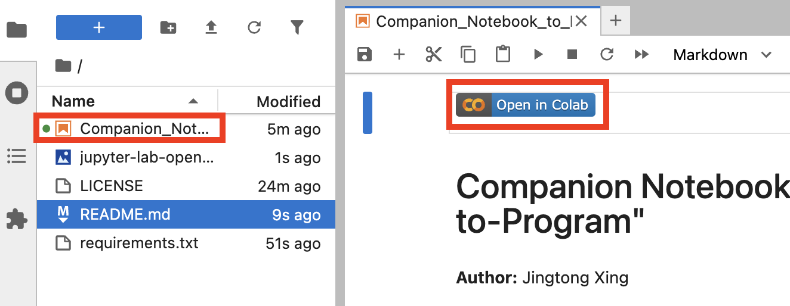

# Reproducibility Study of "Uncertainty-Aware Text-to-Program for QA on Structured EHR"

[](https://colab.research.google.com/github/justthea/cs598-dl4h-uncertainty-qa-ehr/blob/main/Companion_Notebook_to_Reproducibility_Study_of_Uncertainty_Aware_Text_to_Program.ipynb) 

**Author:** Jingtong Xing (jxing11)

**Course:** CS598 Deep Learning for Healthcare (dl4h), University of Illinois Urbana-Champaign

This repository contains the code and resources for a reproducibility study of the paper "Uncertainty-Aware Text-to-Program for Question Answering on Structured Electronic Health Records" by Kim et al. (CHIL 2022).

**Original Paper:** [Uncertainty-Aware Text-to-Program for Question Answering on Structured Electronic Health Records](https://arxiv.org/abs/2203.06918)
**Original Authors' Repository:** [cyc1am3n/text2program-for-ehr](https://github.com/cyc1am3n/text2program-for-ehr)

**My Project Report:** https://docs.google.com/document/d/12-9D81NqMNF50Luam7s_O3NXfoime_0hbXVUuKOaw8Y/edit?usp=sharing

**My Project Video Presentation:** https://drive.google.com/file/d/1WJY-VBikChIie8oC7BO2rf3AsuH-UDa_/view?usp=sharing

**My PyHealth PR:** https://github.com/sunlabuiuc/PyHealth/pull/487

## ML Code Completeness Checklist

Following the recommendations from [paperswithcode/releasing-research-code](https://github.com/paperswithcode/releasing-research-code):

- [x] **1. Specification of dependencies:** Provided via `Companion_Notebook_to_Reproducibility_Study_of_Uncertainty_Aware_Text_to_Program.ipynb` module install cell and `requirements.txt`.
- [x] **2. Training code:** Available in the main Jupyter Notebook (`Companion_Notebook_to_Reproducibility_Study_of_Uncertainty_Aware_Text_to_Program.ipynb`).
- [x] **3. Evaluation code:** Available in the main Jupyter Notebook.
- [x] **4. Pre-trained models:** The fine-tuned T5 model checkpoint is saved by the notebook and can be reloaded for inference and evaluation. Instructions are in the notebook.
- [x] **5. README file including table of results accompanied by precise commands to run/produce those results:** This README aims to fulfill this. See sections below.

## Project Overview

This project attempts to reproduce key components of the original paper, focusing on the text-to-program generation pipeline using a T5 model and an exploration of uncertainty estimation with MIMIC-IV demo data. Due to computational and data constraints, this reproduction adapts certain aspects, such as using a much smaller synthetic dataset and a heuristic for uncertainty (Program Inconsistency Score - PIS).

Key components reproduced/adapted:
*   Data setup using DuckDB with MIMIC-IV demo CSVs.
*   Implementation of 14 atomic operations as Python functions.
*   Generation of a small synthetic dataset (56 question-program pairs).
*   Fine-tuning a T5-base model for the text-to-program task.
*   Evaluation using Execution Accuracy (AccEx) and Program Inconsistency Score (PIS) for uncertainty.
*   A basic clarification mechanism triggered by high PIS.

## Setup and Installation

1.  **Clone the repository:**
    ```bash
    git clone https://github.com/justthea/cs598-dl4h-uncertainty-qa-ehr.git
    cd cs598-dl4h-uncertainty-qa-ehr
    ```

2.  **Create a Python virtual environment (recommended):**
    ```bash
    python3 -m venv venv
    source venv/bin/activate  # or windows equivalent like `venv\Scripts\activate`
    ```

3.  **Install dependencies (Optional):**
    If you want to install the dependencies manually, run the following command, otherwise the dependencies will be installed automatically when you run the notebook.
    ```bash
    pip install -r requirements.txt
    ```

4.  **Download MIMIC-IV Clinical Database Demo (v2.2):**
    The notebook (`Companion_Notebook_to_Reproducibility_Study_of_Uncertainty_Aware_Text_to_Program.ipynb`) contains a cell (Cell 1) with a `wget` command to download the demo CSVs into a `data/mimiciv_demo/2.2/` directory. Ensure this cell is run or download the data manually and place it in the expected location.
    *   The demo data can be found on PhysioNet: [MIMIC-IV Clinical Database Demo v2.2](https://physionet.org/content/mimic-iv-demo/2.2/).
    *   **Note**: The notebook expects the `.csv.gz` files to be within subdirectories like `hosp/` and `icu/` under `data/mimiciv_demo/2.2/`.

## Running the Code

The core logic is contained within the Jupyter Notebook:
`Companion_Notebook_to_Reproducibility_Study_of_Uncertainty_Aware_Text_to_Program.ipynb`

**Steps:**

1.  **Install Dependencies:** Ensure you have the necessary packages installed. You can use the requirements file:
    ```bash
    pip install -r requirements.txt
    # Note: The notebook itself also contains a !pip install cell
    ```

2.  **Open Jupyter/Google Colab Notebook:** Start the Jupyter Notebook server (e.g. Jupyter Lab) from your terminal in the project's root directory:
    ```bash
    # if you are on macos and need to install jupyterlab
    # brew install jupyterlab
    # or other installation instructions: https://jupyterlab.readthedocs.io/en/latest/getting_started/installation.html

    jupyter lab
    ```
The notebook should be served at `http://localhost:8888/lab/tree/Companion_Notebook_to_Reproducibility_Study_of_Uncertainty_Aware_Text_to_Program.ipynb`, if not navigate to the file (`Companion_Notebook_to_Reproducibility_Study_of_Uncertainty_Aware_Text_to_Program.ipynb`) in the Jupyter interface in your browser.

You can also view and run the notebook in Google Colab by clicking the [](https://colab.research.google.com/github/justthea/cs598-dl4h-uncertainty-qa-ehr/blob/main/Companion_Notebook_to_Reproducibility_Study_of_Uncertainty_Aware_Text_to_Program.ipynb) button on the top of the notebook view.



3.  **Run Notebook:** Navigate to and open the `Companion_Notebook_... .ipynb` file in the Jupyter interface in your browser. Execute all cells sequentially from top to bottom.
    *   The notebook will download the MIMIC-IV Demo dataset on its first run.
    *   It will fine-tune a T5 model and save the best checkpoint.
    *   It will perform evaluation, printing metrics like Execution Accuracy (AccEx), AUROC, and Program Inconsistency Score (PIS) heuristics.

## Citation

If you use the original paper, please cite:
```bibtex
@inproceedings{kim2022uncertainty,
  title={Uncertainty-Aware Text-to-Program for Question Answering on Structured Electronic Health Records},
  author={Kim, Dokyoon and Bae, Siho and Kim, Sangmo and Choi, Edward},
  booktitle={Conference on Health, Inference, and Learning},
  pages={200--213},
  year={2022},
  organization={PMLR}
}
```

## License

This project is licensed under the MIT License - see the [LICENSE](LICENSE) file for details.
